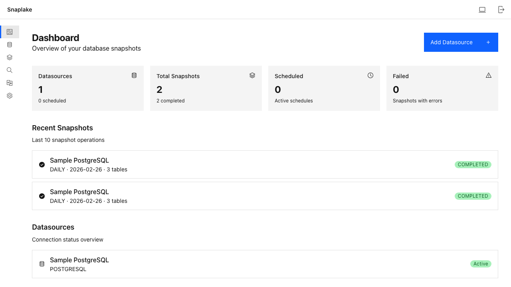
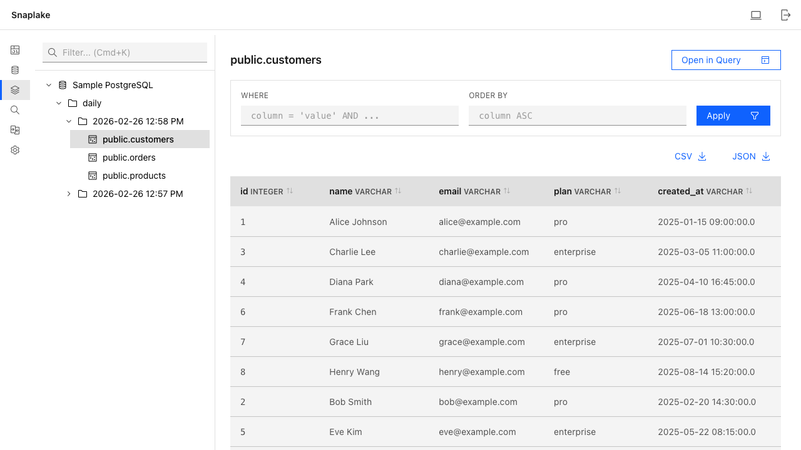
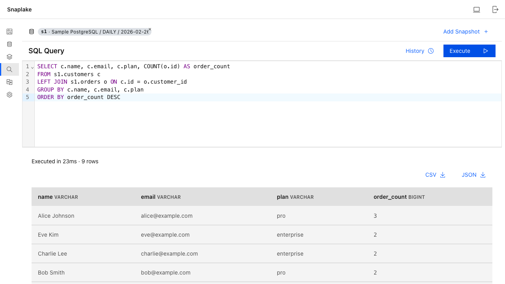
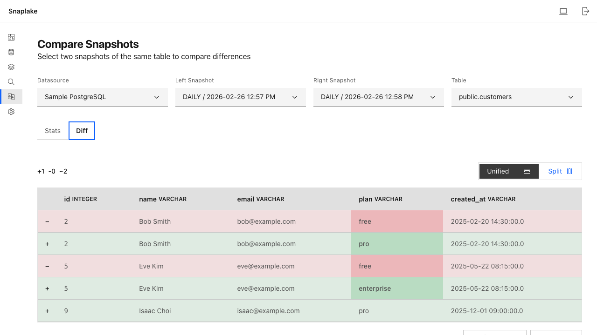

> [English](README.md)

# Snaplake

셀프 호스팅 데이터베이스 스냅샷 관리 플랫폼. PostgreSQL과 MySQL 데이터베이스의 특정 시점 스냅샷을 Parquet 파일로 캡처하고, 로컬 또는 S3에 저장하며, DuckDB 기반 SQL로 스냅샷을 조회하고 비교할 수 있습니다.



## 주요 기능

### 데이터베이스 스냅샷

테이블 전체를 Apache Parquet 파일로 캡처합니다. 필터링, 정렬, CSV/JSON 내보내기로 스냅샷 내용을 탐색할 수 있습니다.



### SQL 쿼리 엔진

DuckDB를 사용하여 모든 스냅샷에 SQL 쿼리를 실행합니다. 테이블 조인, 데이터 집계, 결과 내보내기가 가능합니다.



### 스냅샷 비교

두 스냅샷을 나란히 비교하여 행 단위 차이를 확인합니다. 추가, 삭제, 변경된 행을 색상으로 구분하여 즉시 파악할 수 있습니다.



### 기타 기능

- **예약 스냅샷** — 데이터소스별 Cron 기반 자동 스냅샷
- **보존 정책** — 일별/월별 보존 제한으로 스토리지 자동 관리
- **유연한 스토리지** — 로컬 파일 시스템 또는 S3 호환 오브젝트 스토리지 (AWS S3, MinIO 등)
- **설정 마법사** — 관리자 계정, 스토리지, 첫 데이터소스 설정을 안내하는 초기 설정 가이드
- **다크 모드** — 다크/라이트 테마 전체 지원

## 빠른 시작

### Docker (권장)

```bash
docker run -d \
  --name snaplake \
  -p 8080:8080 \
  -v snaplake-data:/app/data \
  abcdkh1209/snaplake:latest
```

[http://localhost:8080](http://localhost:8080)을 열고 설정 마법사를 따라 진행하세요.

### 샘플 데이터베이스로 체험

사전 구성된 PostgreSQL 데이터베이스가 포함된 데모 compose 파일이 제공됩니다:

```bash
docker compose -f docker-compose.demo.yml up
```

Snaplake와 함께 샘플 데이터(customers, products, orders)가 로드된 PostgreSQL 인스턴스가 시작됩니다. 설정 시 다음 정보로 연결하세요:

| 항목 | 값 |
|---|---|
| Host | `sample-db` |
| Port | `5432` |
| Database | `sampledb` |
| Username | `demo` |
| Password | `demo1234` |

### 로컬 개발

**사전 요구사항:** Java 21, [Bun](https://bun.sh)

```bash
# 백엔드 시작 (포트 8080)
./gradlew bootRun

# 프론트엔드 개발 서버 시작 (포트 5173, 백엔드로 프록시)
cd frontend && bun install && bun run dev
```

## 설정 가이드

첫 실행 시 설정 마법사가 초기 설정을 안내합니다. 자세한 내용은 [설정 가이드](docs/setup-guide.ko.md)를 참조하세요.

## 환경 설정

모든 설정은 환경 변수로 관리합니다:

| 변수 | 기본값 | 설명 |
|---|---|---|
| `SNAPLAKE_DATA_DIR` | `./data` | SQLite 메타데이터 DB 및 로컬 스냅샷 디렉토리 |
| `SNAPLAKE_PORT` | `8080` | 서버 포트 |
| `SNAPLAKE_JWT_SECRET` | (자동 생성) | JWT 서명 시크릿 |
| `SNAPLAKE_ENCRYPTION_KEY` | (자동 생성) | 데이터소스 비밀번호 암호화용 AES 키 |

스토리지(Local 또는 S3)는 설정 시 웹 UI에서 구성합니다.

## 아키텍처

관심사의 명확한 분리를 위한 Hexagonal Architecture:

```
adapter/inbound     (Web, CLI, Scheduler)
        |
application/port    (UseCase interfaces, Port interfaces)
application/service (UseCase implementations)
        |
domain/model        (Pure Kotlin domain models)
        |
adapter/outbound    (JPA, DuckDB, S3, Local Storage)
```

의존성 방향: `adapter -> application -> domain`

### 확장 포인트

- **DatabaseDialect** — 새로운 데이터베이스 유형 지원 추가 (현재 PostgreSQL, MySQL)
- **StorageProvider** — 새로운 스토리지 백엔드 추가 (현재 Local, S3)

## 기술 스택

| 계층 | 기술 |
|---|---|
| Backend | Kotlin, Spring Boot 3.4, Java 21 |
| Metadata DB | SQLite |
| Query Engine | DuckDB |
| Snapshot Format | Apache Parquet |
| Frontend | React 19, TypeScript, Vite |
| UI Components | Carbon Design System |
| Routing / State | TanStack Router, TanStack Query |
| Auth | JWT + Argon2 |
| Storage | Local filesystem / S3-compatible |

## 빌드

```bash
# 전체 빌드 (백엔드 + 프론트엔드)
./gradlew build

# 테스트 실행
./gradlew test

# 프론트엔드만
cd frontend && bun run build

# 프론트엔드 린트
cd frontend && bun run lint
```

## 라이선스

이 프로젝트는 [MIT License](LICENSE)에 따라 라이선스가 부여됩니다.
