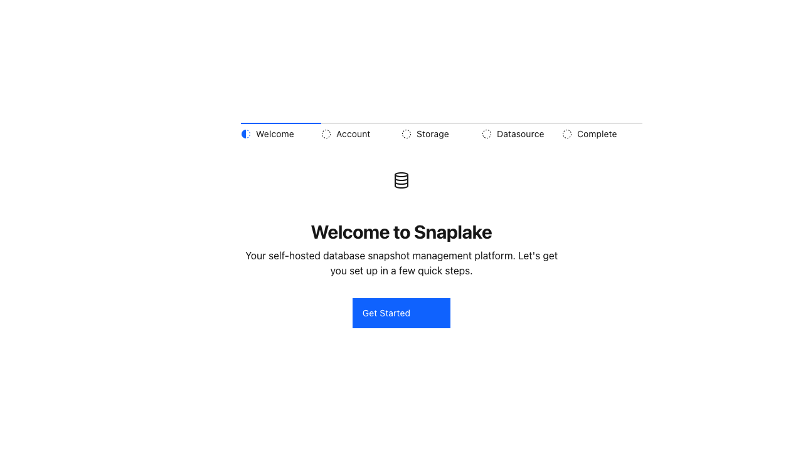
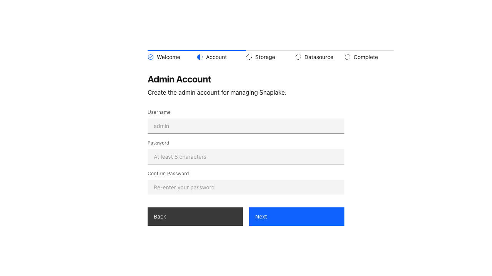
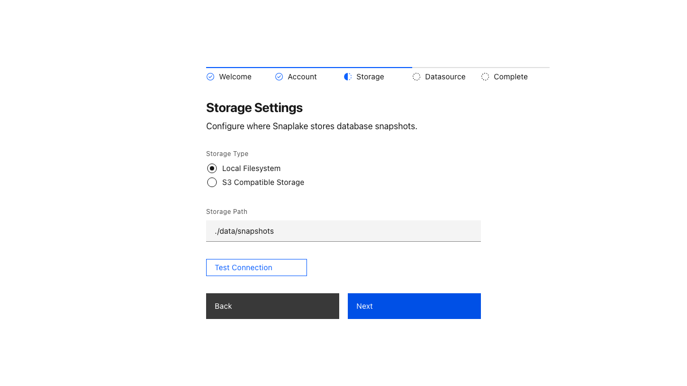
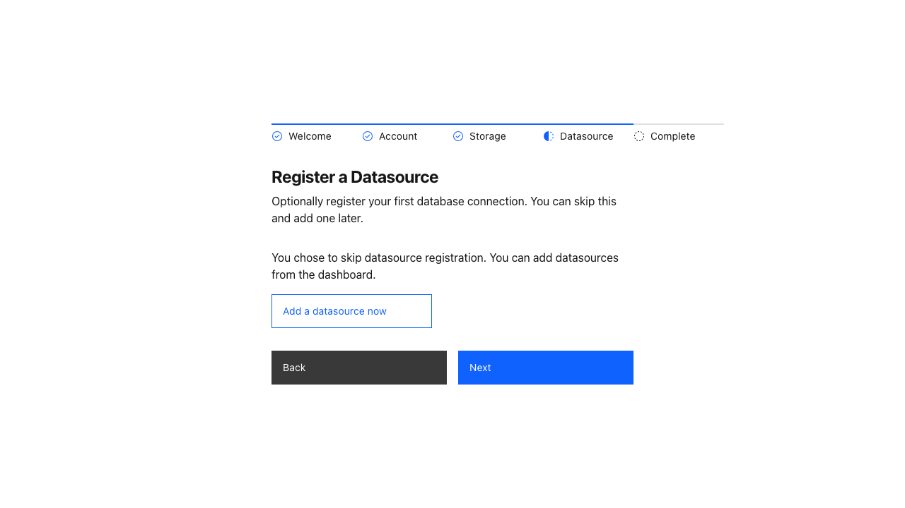
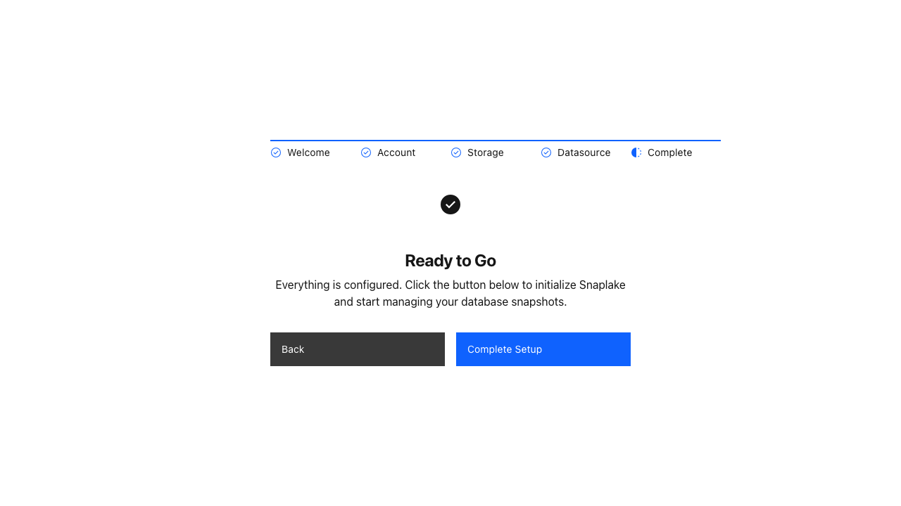

# Setup Guide

On first launch, the setup wizard walks you through initial configuration:

| Step | Description |
|---|---|
|  | **1. Welcome** — Start the setup process |
|  | **2. Account** — Create your admin account |
|  | **3. Storage** — Configure local or S3 storage |
|  | **4. Datasource** — Optionally register your first database |
|  | **5. Complete** — Finalize and start using Snaplake |
